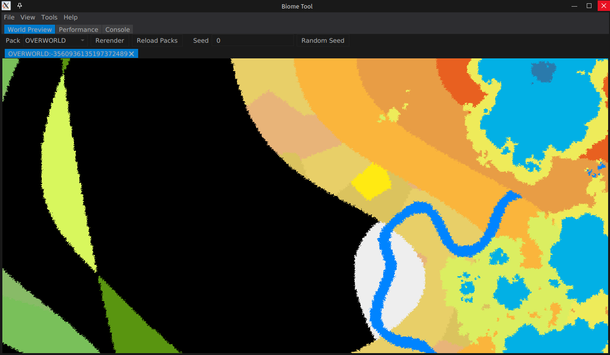

# Biome Tool

The Biome Tool is a creatively named utility for developing biome configurations for Terra

This is a simple dummy platform implementation that provides mock objects to the platform, focusing only on loading biomes.

It should work with most Terra addons, it's been tested extensively and verified to work with the core addons.

## Downloading

To download the biome tool jar, go to the [releases page](https://github.com/PolyhedralDev/BiomeTool/releases/latest/), and you can find a selection of jars to download. Download the
correct one for your platform.

- For Windows, download the `BiomeTool-*-win.jar` file.
- For macOS, download the `BiomeTool-*-osx.jar` file.
- For Linux, download the `BiomeTool-*-linux.jar` file.

All of these files bundle the required javafx libraries, so you can run them without having to install it.

## Usage

1. Download the tool and place it in the directory you wish to use it in.
2. Download and install all required Terra addons into the `addons` folder
3. Install any packs you wish to test into a `packs` folder either as zip files or as a folder inside `packs`.
4. Either run the tool from the command line with `java -jar BiomeTool-*.jar` or double click on it to execute it as a java program.

Note: You **must** be using Java 17. It will not work with earlier versions.

Use Java 17

## Screenshots

